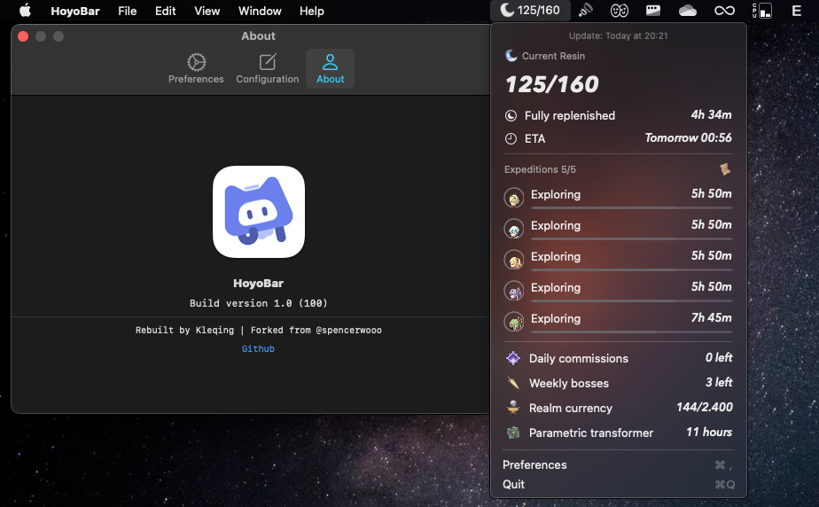

  
  <h3><code>HoyoBar</code></h3>
  
<em>Real-time tracking your Genshin Impact account status into your macOS menubar</em>

  
  
  

## What's this?

> Paimon helps you track your Genshin Impact daily resin, expeditions, and more — straight in your macOS menu bar.

Paimon can help you —

* 🌙 Keep track of your daily resin.
* 💰 Monitor your daily expeditions and real-time realm currency.
* 🏁 Remind you about your daily commissions and weekly boss fights.
* 🍯 And notify you when your parametric transformer is ready to use.

Basically, `HoyoBar` lives in your macOS menu bar quietly, and offers you a nice way of monitoring your in-game real-time stats when you need to check them.

> **Note**
>
> `HoyoBar` is made with SwiftUI, designed for and native to macOS.
>
> Support both Intel (x86) and M1 (arm64)

## Download

## Setup

 
Post-install

 

> Open `.dmg` file, copy `HoyoBar.app` to /Application
>
> Open `HoyoBar.app`
>
> In menubar, press the `-/160` and press `Preferences` - `Configuration`
>
> Open [Chrome](https://www.google.com/chrome) and go to [HoyoLab](https://www.hoyolab.com)
>
> Open DevTools and go to `Console` tab, then type `document.cookie` and Enter
>
> Copy cookie and paste it to `HoyoBar`, then press `Test config`
>
> 👍 Enjoy! 
>

> For more infomation about setup, please check https://paimon.swo.moe

## Credits

* Credits to @spencerwoo for his original app. Check [here](https://github.com/spencerwooo/PaimonMenuBar) if you want to use original version instead of this one!

Feature & build

### Features

* [x] Start at login.
* [x] Complie using target 10.13 instead of 11.0+.
* [x] Supported both Intel and M1 Macs.
* [x] Support English, Chinese and Vietnamese.
* [x] Using HoyoLab icon instead of HuTao icon (I love original icon than Hu Tao icon although I got her at 2.2 because I want to make some people think that it's 'HoyoLab Lite')
* [x] Code-sign and publish as `.dmg`
* [x] Custom website and help for acquiring the cookie.
* [x] Support for cn and global genshin accounts (米游社 and hoyolab).
*  ~~[ ] Check for update and auto updates~~

### Build

* Using Xcode 13, Swift 5.5 and SDK 10.13.
* App icon was built from Apple icon template for Adobe Photoshop.
* Using DropDMG to create `.dmg` file.

## Things to know

1. HoyoBar uses the official Hoyoverse API found in either [米游社 (for CN players)](https://bbs.mihoyo.com/ys/) or [HoYoLAB (for Global players)](https://www.hoyolab.com/home).
2. Yes, HoyoBar needs your cookie. It is so that HoyoBar can request said API on your behalf, and fetch those in-game stats periodically. Rest assured that **the cookie is only stored locally.**
3. Because this is the rebuild version, updates aren't working at this time. I will tried to add it soon!

## License

  
  <em>Rebuilt by <a href="https://github.com/kleqing">kleqing</a> All credits and copyright are belongs to <a href="https://spencerwoo.com">spencerwoo</a></em>
   
  <em>This is a forked version and I just built for mine. For the long term support, please using the <a href="https://github.com/spencerwooo/PaimonMenuBar">original</a> one.</em>
   
  <em>HoyoBar is not affiliated with <a href="https://www.hoyoverse.com">Hoyoverse.</a> Game content and materials are trademarks and copyright of Hoyoverse and spencerwoo.</em>

